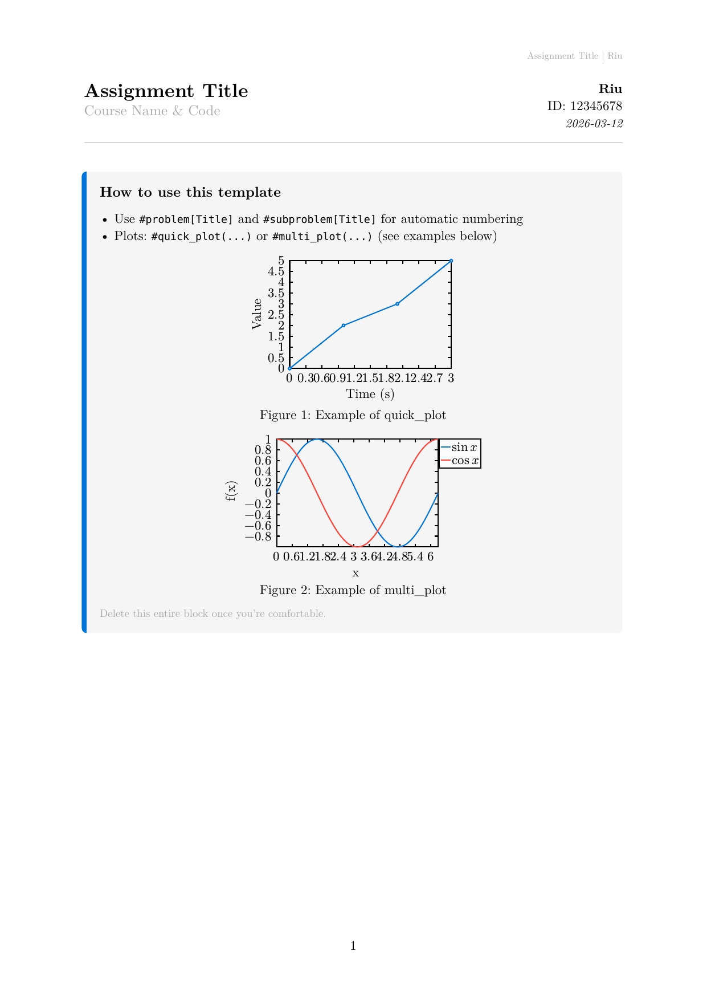

# Typst Local Packages

This repository contains local Typst packages, along with a small helper script to install them into Typst's local package directory.

Currently it includes:

- `assignment_template` (`local/assignment_template/0.1.0`)

## Repository layout

- `local/` – Namespace for local Typst packages.
  - `assignment_template/0.1.0/` – A private assignment template package.
    - `typst.toml` – Package metadata (name, version, entrypoint, description, etc.).
    - `lib.typ` – Main library file exported by the package.
    - `template/` – Template entrypoint and related files (e.g. `main.typ`).
- `install.sh` – Script to copy the packages in `local/` into Typst's local package directory.
- `assignment-preview.png` – Screenshot of the assignment template (first page).
- `LICENSE` – MIT No Attribution (MIT-0) license.

## Installation

You can install the packages into your Typst local package directory with:

```bash
chmod +x install.sh        # only needed once
./install.sh
```

By default the script installs to:

- **Linux**: `${XDG_DATA_HOME:-$HOME/.local/share}/typst/packages`
- **macOS**: `$HOME/Library/Application Support/typst/packages`
- **Windows** (Git Bash, MSYS2, Cygwin): `%APPDATA%\typst\packages` (e.g. `C:\Users\<you>\AppData\Roaming\typst\packages`)

You can override the destination by setting `TYPST_PACKAGE_DIR`:

```bash
TYPST_PACKAGE_DIR="/path/to/typst/packages" ./install.sh
```

## Using the packages in Typst

After running `install.sh`, Typst should see the package under the `local` namespace. For example, you can import the assignment template in a Typst document as:

```typ
import "@local/assignment_template:0.1.0": *
```

Adjust the version or imported symbols as needed for your document.

## Template display

The assignment template provides a document layout and helpers for typed assignments.



**Page**

- A4, 2.5 cm margins
- Header: right-aligned, small gray text `Title | Author`
- Page numbering: `1`, `2`, …

**Header block**

- Two-column grid at the top of the first page:
  - **Left:** Assignment title (16 pt bold), course name/code (12 pt gray)
  - **Right:** Author (italic), student ID, date (italic; defaults to today)
- A horizontal rule separates the header from the body.

**Body**

- Base font: New Computer Modern, 11 pt
- Use `#problem[Title]` and `#subproblem[Title]` for auto-numbered problems and (a), (b), …
- Use `#quick_plot(...)` and `#multi_plot(...)` for inline plots (via CeTZ).

**Template files**

- Compile `template/main.typ` to build a document. It uses `info.typ` for your personal metadata (author, student ID, course, optional date); edit `info.typ` (or a copy like `info.typ.example`) with your details.

## License

This repository is licensed under the **MIT No Attribution License (MIT-0)**. See [LICENSE](LICENSE) for the full text. You may use, copy, modify, and distribute the software for any purpose without attribution.
